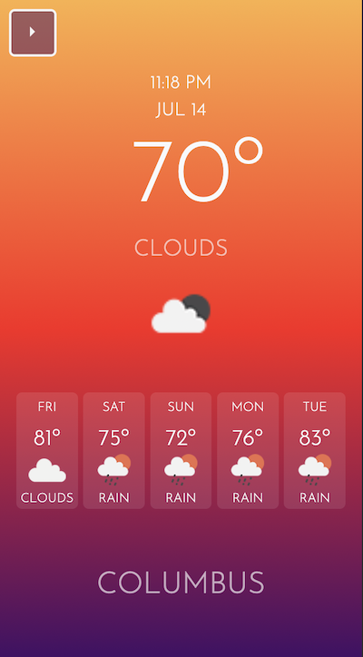

# Weather App

## Description

A weather application that allows a user to search the weather outlook for multiple cities in the US

## Features

 Upon searching a city, user is presented with current and future conditions for that city. , + the city is saved in the search history. <!--Current weather conditions reflect the temperature, humidity, wind speed, and the UV index. UV index is color coded to indicate whether the conditions are favorable, moderate, or severe. -->Future weather conditions present a 5-day forecast that displays the date, weather conditions, and temperature. Cities saved in search history render conditions when clicked.

User experience is intuitive and easy to navigate; user interface style is clean and polished.

## Road Map

Currently only styled for mobile. In progress.

TODO:

- media queries to display properly on all viewport sizes
- word suggestions in search bar / check for edge cases for misspelled cities, etc.
- bootstrap carousel for different displays with more weather information

### Visuals

### Links

[Deployed on GitHub Pages](<https://kathrynwilkinson.github.io/Weather-App/>)
